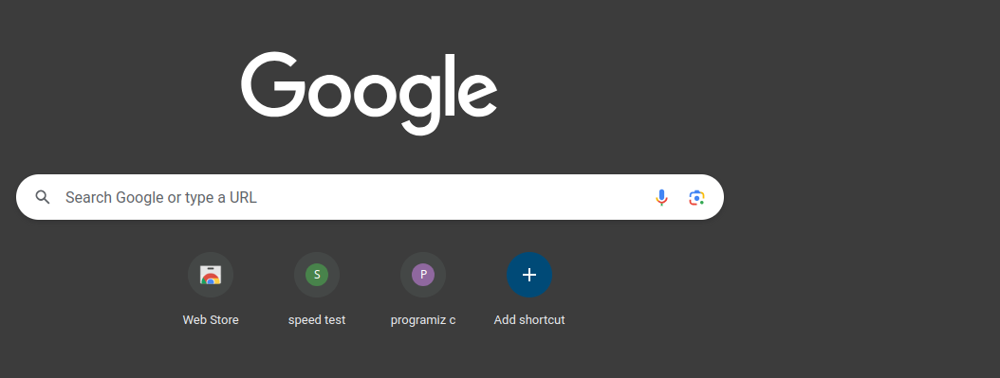
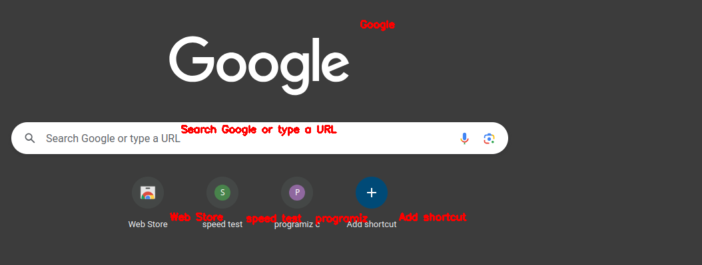

# Text Correction and OCR Processing

## Project Overview

**Text Correction and OCR Processing** is a Python project designed to extract and correct text from images using OCR (Optical Character Recognition) and spell-checking techniques. The project utilizes the following libraries:

- **EasyOCR** for extracting text from images.
- **SpellChecker** for correcting spelling errors in the extracted text.
- **OpenCV** for drawing the corrected text on the images and displaying the processed result.
-
## Project Structure

The project directory structure is as follows:

```
TextRecognizerOCR/
├── main.py
├── requirements.txt
├── sample_image.jpg
└── README.md
```

### Core Files Explained

1. **main.py**
   - **Description**: The main script that processes images to extract, correct, and annotate text.
   - **Features**:
     - Extracts text using EasyOCR.
     - Corrects spelling with SpellChecker.
     - Draws corrected text on the image and saves the output.

2. **requirements.txt**
   - **Description**: Contains the Python libraries required to run the project.
   - **Contents**:
     ```text
     easyocr==1.6.2
     opencv-python==4.7.0.68
     pyspellchecker==0.6.3
     ```

## Installation and Setup

### Prerequisites

- Python 3.x (recommended: Python 3.8 or higher)

### Installation Steps

1. Clone the repository:
   ```bash
   git clone https://github.com/yourusername/TextCorrectionOCR.git
   cd TextCorrectionOCR
   ```

2. Create a virtual environment:
   ```bash
   python -m venv venv
   source venv/bin/activate  # On Windows: venv\Scripts\activate
   ```

3. Install the required dependencies:
   ```bash
   pip install -r requirements.txt
   ```

## How to Use

1. Place the image you wish to process in the project directory.
2. Update the `image_path` variable in `main.py` to match the path of your image.
3. Run the script:
   ```bash
   python main.py
   ```

4. The processed image with corrected text will be saved as `corrected_output_image.png` in the project directory and displayed on your screen.

## Example

### Input Image

Below is an example of an input image:



### Output Image

Here is an example of the processed image with corrected text:



## Additional Notes

- The processed output image will be saved in the project directory with the name `corrected_output_image.png`.
- Ensure that your Python environment is configured properly and all necessary libraries are installed before running the script.


### How to Add Images to the Project:

- Place the input and output images in your project directory and refer to them using the relative path as shown above. This ensures they appear properly in the `README.md`.

If you need assistance with adding more details or images, let me know!
